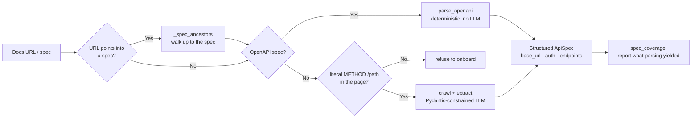
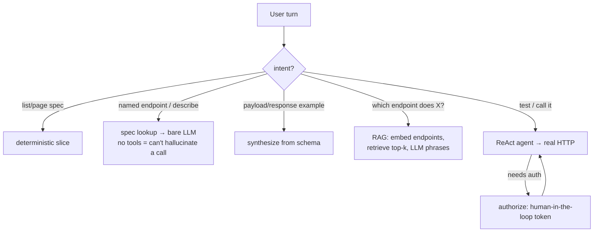

# SaaS Onboarding Agent

**A local, agentic assistant that reads a SaaS product's API docs and bootstraps a real, grounded integration — no cloud, no API keys, no cost.**

Point it at a docs URL or an OpenAPI spec. It extracts a structured API spec (base URL, auth, endpoints), answers "which endpoint does X / what's the payload," and — on request — makes a **real, authenticated HTTP call** on your behalf. Runs entirely on a local 7B model via [Ollama](https://ollama.com).

> **The engineering focus:** making a *small* local model behave reliably — no hallucinated endpoints, no leaked secrets, no fabricated results. The interesting work is the guardrails, not the happy path.

---

## Problem

Every new SaaS tool means someone technical manually reading API docs: *base URL? auth? which endpoints? shape of a first request?* — the same read → parse → try loop before your first successful call. This automates that discovery step.

---

## Architecture

Onboarding is **OpenAPI-first**: a machine-readable spec is parsed deterministically (no LLM); scraping is the fallback.



Each **conversation turn** is routed by intent — deterministic decisions taken *out* of the weak model:



---

## Design decisions (the reliability layer)

| # | Decision | Why it matters |
| :- | :--- | :--- |
| 🔐 | **Secrets never reach the model** | Token flows `human → interrupt() → SECRETS dict → HTTP headers`. The model only ever emits `Bearer {{TOKEN}}`; the real value is substituted inside `make_api_call`, never in message history. |
| 🎯 | **Structured output > bigger model** | Extraction is constrained decoding via Pydantic (`with_structured_output`), so the model *can't* return anything but schema-valid JSON. Killed hallucinated endpoints on 7B — no extra VRAM. |
| 🚧 | **Evidence gate before extraction** | Structured output constrains the *shape* of an answer, never whether there was anything to answer. Handed a Stoplight **model export** (a bare JSON-Schema fragment — no `paths:`, zero HTTP verbs), extraction returned **12 confident endpoints** assembled from nouns in the schema: every noun real, every method and path parameter invented, every one schema-valid. `_has_endpoint_evidence` now requires a literal `METHOD /path` pair before a chunk ever reaches the model, and `extract_from_pages` **raises** rather than onboarding from guesses. |
| 🧱 | **Grounding guards** | `make_api_call` refuses any path whose segments never appeared in fetched docs. The system prompt treats only real Tool Messages as truth. |
| 🔎 | **Verify the model's *output*, not just its input** | The 7B obeyed the grounding prompt for four turns, then emitted `POST /scheduled_events` — inventing a verb because the collection existed, and attaching another endpoint's required fields to it. Retrieval was correct; the model added a fact that was never in context, so no prompt wording fixes it. `verify_endpoint_mentions` re-extracts every `METHOD /path` from the answer and checks it against the spec; all three spec-answering routes go through `grounded_answer`, so the check can't be forgotten at one call site. |
| 📉 | **Report coverage — extraction fails silently** | An unresolved `$ref` renders as `{}`; a `$ref` parameter is skipped; scopes in prose come back `[]`. Nothing raises — the agent just describes a smaller, emptier API than the real one, and you find out several turns later via a confidently wrong answer. `spec_coverage()` prints what the parse actually *yielded* (endpoints, how many carry auth/params/schemas, plus a `$ref` audit: resolved / broken / remote). A scraped spec is labelled `SCRAPED, NOT PARSED` — its zeros are structural, not a parser bug. |
| 🗺️ | **OpenAPI-first — and *find* the spec** | If a spec exists, parse it deterministically (URL or local file, JSON **or** YAML). Doc portals export *pieces* of a spec by appending a pointer to its own path (`…/openapi.yaml/components/schemas/Event`); `_spec_ancestors` walks structurally back up to the spec itself, and every candidate is still validated. On that URL it's the difference between 12 fabricated endpoints and the real **61**. |
| 🧭 | **Intent routing + RAG** | A 7B can't be trusted to pick tools, so the REPL routes per turn. Discovery uses embeddings (`nomic-embed-text`, in-memory cosine) to retrieve the real endpoints instead of letting the model confabulate from a truncated context. |
| 🏠 | **Fully local** | Ollama = no paid API, no data leaves the machine, runs on an 8 GB consumer GPU. |

The routing is an honest *reliability substitute* for a weak model — with a frontier model you'd delete most of it and give the agent a `search_endpoints` tool.

---

## Quickstart

**Prereqs:** Python ≥ 3.14 · [uv](https://docs.astral.sh/uv/) · [Ollama](https://ollama.com) with models pulled:
```bash
ollama pull qwen2.5:7b        # agent / chat model
ollama pull nomic-embed-text  # embeddings for discovery RAG (falls back to keyword if absent)
```
```bash
uv run python agent.py        # interactive agent — the main program
#   type a docs URL or local spec path (JSON/YAML); ask it to describe / find / test endpoints
#   commands:  extract  (dump full spec)   |   end session  (quit)
```

**Try it:** onboard a spec, then ask natural questions —
```
you> read: ./openapi.json
you> which endpoint lets me update a meeting?      # → RAG discovery
you> what's the payload for PATCH /meetings/{id}?  # → example synthesized from schema
you> test the list endpoint                        # → real, grounded HTTP call
```

---

## Scope & limitations

Deliberately scoped as a **bootstrapping accelerator and portfolio piece, not a production tool.**

- **Built for small-to-moderate APIs.** The whole thing runs on a local 7B at `num_ctx=8192`, so an endpoint's full documentation — every parameter, plus its request and response schema expanded to *all* nested levels — has to fit in a few thousand tokens. That holds comfortably for typical SaaS specs (across Calendly's 61 endpoints a complete nested response tree is ~600 chars at the median, ~2.4 KB at the worst). A very large or deeply nested API — sprawling polymorphic schemas, dozens of levels, huge `oneOf` unions — will exceed that budget on a single machine with 8 GB VRAM. It degrades rather than breaks: the schema is cut to fit and **labelled `[!] TRUNCATED`** in the same breath, so the model states plainly that it is not the full schema and points you at the vendor's docs, instead of presenting a partial API as a complete one. Bigger APIs want a bigger context window, not a code change.
- **Output grounding assumes the spec is ground truth.** `verify_endpoint_mentions` validates an answer *against the parsed spec*, so it is useless when the spec itself is the fabrication — a scraped `POST /scheduled_events` gets certified as real. That assumption is precisely what the upstream evidence gate exists to protect, and why a scraped spec is labelled as uncorroborated rather than merely under-annotated.
- **Discovery is only as good as a small local embedder** — vocabulary-overlap queries land; hard synonym leaps ("set up a video call" → *meeting*) can miss.
- **Session state is in-memory** (`MemorySaver`) — a restart loses history; the RAG index rebuilds once per spec per session (~45s, no disk cache yet).
- **Large *scraped* doc sets are front-truncated** before extraction; the clean lane is OpenAPI. Scrape fallback is noisy on sprawling hypermedia docs (e.g. GitHub) — an accepted trade-off.
- **Verified against:** deterministic OpenAPI parse (Swagger Petstore 2.0 **and** 3.0, Calendly 61-endpoint spec, Zoom 184-endpoint spec); secret-handling proven end-to-end on `httpbingo.org/bearer`. Real third-party `200`s shown on public/no-auth endpoints.
- **Call-fidelity audit:** `tests/test_call_fidelity.py` asserts the parser keeps every fact an HTTP request depends on — where the credential goes (`apiKey in header api_key` ≠ `Bearer`), request bodies in both OpenAPI 3 and Swagger 2.0 layouts, media types, nested required fields, validation constraints, `deprecated`. Runs against pinned specs in `tests/fixtures/` (pinned deliberately — a hosted spec that gains endpoints between runs makes a vendor release look like a regression).

**Shipped:** local JSON/YAML specs · intent routing + RAG discovery · method-aware matching (`update`→PATCH) · endpoint pagination · last-endpoint memory for follow-ups · fully-nested schema expansion with announced truncation · evidence gate before extraction · spec walk-up from a pointer URL · output-side endpoint verification · scraped-vs-parsed provenance in the coverage report · per-turn error safety net.

**Next:** persist the RAG index to disk · Streamlit UI (the hard part: mapping the `interrupt()` auth handoff onto Streamlit reruns) · code-snippet generation built from *real tool results*.

---

## Tech stack

**Python 3.14** · **LangGraph** (`create_react_agent`, `interrupt`, `MemorySaver`) · **Ollama** (`qwen2.5:7b`, `nomic-embed-text`) · **Pydantic** (constrained extraction) · **requests + BeautifulSoup** (scraping) · **pyyaml** · **uv** (packaging).

| File | Role |
| :--- | :--- |
| **`agent.py`** | The project. ReAct agent + tools (`fetch_url`, `make_api_call`, `authorize`), OpenAPI-first `onboard()`, intent-routing REPL, RAG discovery index. |
| **`scraper.py`** | `fetch_text` (strips boilerplate, returns text + links) and `crawl` (BFS over doc pages). |
| **`extract.py` / `main.py`** | One-shot prose-summary path + its CLI entry point. |

---

*A hands-on study in agentic workflow design, local-LLM reliability, and safe credential handling.*
