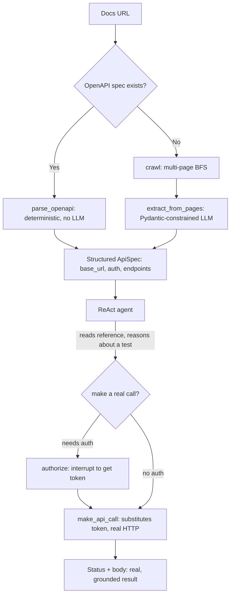

# SaaS Onboarding Agent

**A local, agentic assistant that reads a SaaS product's API documentation and bootstraps a real, grounded integration — no cloud, no API keys, no cost.**

Give it a documentation URL. It explores the docs like a developer would, extracts a structured API spec (base URL, auth method, endpoints), and — when you ask — makes a **real, authenticated HTTP call** on your behalf. Runs entirely on a local LLM via [Ollama](https://ollama.com).

---

## The problem it solves

When a company adopts a new SaaS tool, someone technical — a solutions engineer, forward-deployed engineer, or developer — has to sit down and manually read the API docs: *What's the base URL? How does auth work? Which endpoints exist? What's the shape of a first request?* It's the same repetitive read → parse → try loop for every new tool, and it stands between you and your first successful API call.

This project automates that discovery step so you get to a working first call faster.

> *Framing from real experience: technical teams routinely spend hours just figuring out how to make their first call to a new API. This tool compresses that.*

---

## What makes it interesting (design decisions)

Most of the engineering effort here went into a single hard problem: **making a small (7B) local model behave reliably** — no fabrication, no leaking secrets, no calling endpoints that don't exist. The interesting parts are the guardrails, not the happy path.

### 1. Secrets never reach the model 🔐
The standout design. When an endpoint needs a token, the model **never sees it**.

- The model only ever emits the literal placeholder `Authorization: "Bearer {{TOKEN}}"`.
- Asking for a credential is a **tool call** (`authorize`) that pauses the graph via LangGraph's `interrupt()`.
- The human supplies the real token out-of-band (`getpass`), which flows back through `Command(resume=...)` into a module-level `SECRETS` dict keyed by host.
- The literal token is substituted into the request headers **only inside `make_api_call`**, at HTTP time.

So the secret travels `human → interrupt() → SECRETS → HTTP headers` and **never enters the message history the LLM sees**. Proven end-to-end against `httpbingo.org/bearer`: the typed token appeared only in the API response, never in any tool argument (which all showed `Bearer {{TOKEN}}`).

### 2. Structured output beats a bigger model 🎯
The original weakness was hallucinated endpoints. The fix wasn't more VRAM — it was **constrained decoding**. Extraction runs through a Pydantic schema (`ApiSpec` / `Endpoint`) via `llm.with_structured_output(...)`, so the model can *only* return schema-valid JSON grounded in the fetched text. This killed fabrication on the existing `qwen2.5:7b` for zero extra cost — a deliberately cost-conscious choice on 8 GB of VRAM.

### 3. Grounding guards 🧱
Two layers stop the agent inventing reality:
- **Endpoint grounding:** `make_api_call` refuses any path whose meaningful segments never appeared in the docs actually fetched (`DOC_CORPUS`) — you can't call what you haven't read.
- **Anti-fabrication prompt:** the system prompt forbids inventing endpoints/responses and treats **only real Tool Messages** as ground truth (the 7B model will otherwise write convincing fake JSON in its own prose).

### 4. OpenAPI-first, scrape-fallback 🗺️
Structured beats scraped. The `onboard()` router first tries to find a machine-readable spec (checks the URL itself, page links, and well-known paths like `/openapi.json`, `/swagger.json`, `/v3/api-docs`). If one exists, it's parsed **deterministically with no LLM at all** (`parse_openapi`) — proven perfect on Swagger Petstore (19 endpoints, zero hallucination). Only when there's no spec does it fall back to multi-page crawling + LLM extraction.

### 5. Fully local 🏠
Ollama exposes the model locally — no paid API, no data leaving the machine. Good for cost, good for privacy, and honest about hardware constraints (runs on an 8 GB consumer GPU).

---

## How it works



The agent is a **ReAct loop** (`create_react_agent`): it reasons in words, then acts by calling a tool, observes the result, and repeats — narrating its plan before each action. Watching it read a docs page, pick an appropriate `list` endpoint on its own, call it, and report a `200` is the whole demo.

---

## Key files

| File | Role |
| :--- | :--- |
| **`agent.py`** | The heart of the project. The LangGraph ReAct agent + its three tools (`fetch_url`, `make_api_call`, `authorize`), the structured-extraction pipeline, and the OpenAPI-first `onboard()` router. |
| **`scraper.py`** | `fetch_text` (requests + BeautifulSoup; strips nav/footer boilerplate, returns text **and** same-host links) and `crawl` (BFS over a section of doc pages). |
| **`extract.py`** | Simplest extractor — one LLM call over a page → prose summary. |
| **`main.py`** | CLI entry point for the one-shot `extract.py` path. |
| **`llm.py`** | A tiny ChatOllama smoke-test. |

---

## Getting started

### Prerequisites
- **Python ≥ 3.14**
- **[uv](https://docs.astral.sh/uv/)** for dependency management
- **[Ollama](https://ollama.com)** running locally, with the model pulled:
  ```bash
  ollama pull qwen2.5:7b
  ```
  > Don't reach for the 14B models on a small GPU — structured output (above) already solved the reliability problem on 7B. This runs comfortably in 8 GB of VRAM.

### Run it
```bash
# Interactive agent (the main program): type a docs URL, ask it to read / summarize / test endpoints
uv run python agent.py
#   commands:  extract  -> dump the structured spec   |   end session  -> quit

# One-shot prose summary of a docs page
uv run python main.py --url <docs-url>

# Deterministic OpenAPI-first onboarding (no LLM when a spec exists)
uv run python -c "from agent import onboard; print(onboard('https://petstore3.swagger.io/api/v3/openapi.json').model_dump_json(indent=2))"
```

Inside the interactive agent, a message containing a URL starts a fresh onboarding; asking it to *"summarize / understand the endpoints"* auto-runs structured extraction and prints an `ApiSpec`.

---

## Tech stack

| Layer | Choice | Why |
| :--- | :--- | :--- |
| Language | Python 3.14 | Standard for the target roles |
| LLM runtime | Ollama | Free, local, private |
| Model | `qwen2.5:7b` (temp 0, `num_ctx` 8192) | Fits 8 GB VRAM; reliable once output is constrained |
| Agent framework | LangGraph (`create_react_agent`, `interrupt`, `MemorySaver`) | ReAct loop, human-in-the-loop, session memory |
| Structured extraction | Pydantic + `with_structured_output` | Constrained decoding = no fabrication |
| Scraping | requests + BeautifulSoup4 | Simple, reliable |
| Packaging | uv | Fast, modern |

---

## Known limitations & roadmap

Scoping is deliberate — this is a bootstrapping accelerator and portfolio piece, **not** a production tool.

- **`onboard()` isn't wired into the interactive REPL yet.** The OpenAPI-first router is built and validated, but the REPL currently drives the agentic + extraction lane; unifying them is the next step.
- **JSON specs only.** YAML OpenAPI specs fall through to scraping (a `pyyaml` parse is the fix).
- **Context window.** Very large doc sets are front-truncated before extraction; the real fix is chunk-summarization or a vector store (RAG) over the corpus — the "if this were production" answer.
- **Scrape-fallback is noisy** on sprawling, hypermedia-heavy docs (e.g. GitHub). OpenAPI is the clean lane; noisy fallback is an accepted, honest trade-off.
- **Real third-party `200`s** are proven on public/no-auth endpoints; the secret-handling path is validated against `httpbingo.org/bearer`.

**What I'd build next:** wire `onboard()` into the loop → intent-based endpoint matching (embeddings) → a Streamlit UI (the genuinely hard part is mapping the `interrupt()` auth handoff onto Streamlit's top-to-bottom reruns) → code-snippet generation built from *actual tool results*, never the model's free text.

---

*Built as a hands-on study in agentic workflow design, local LLM reliability, and safe credential handling.*
